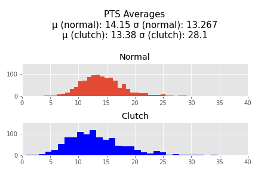
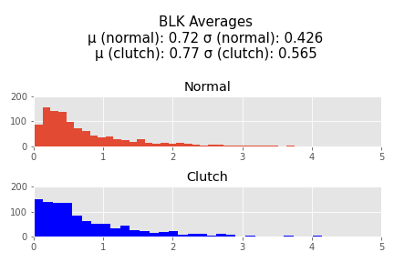
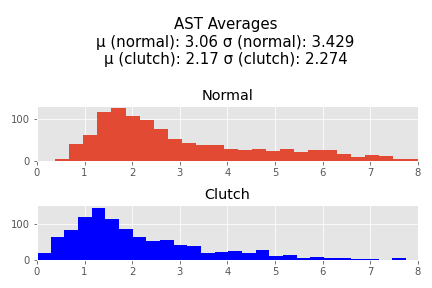
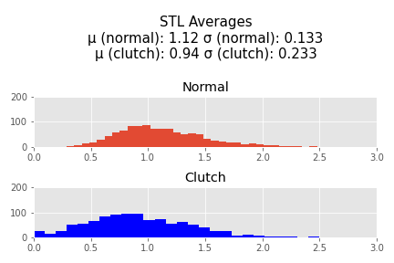
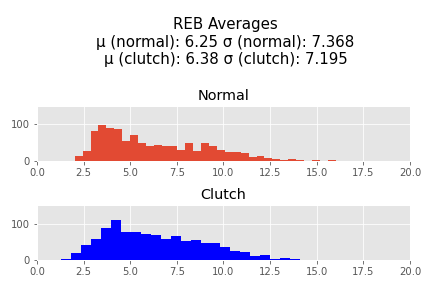
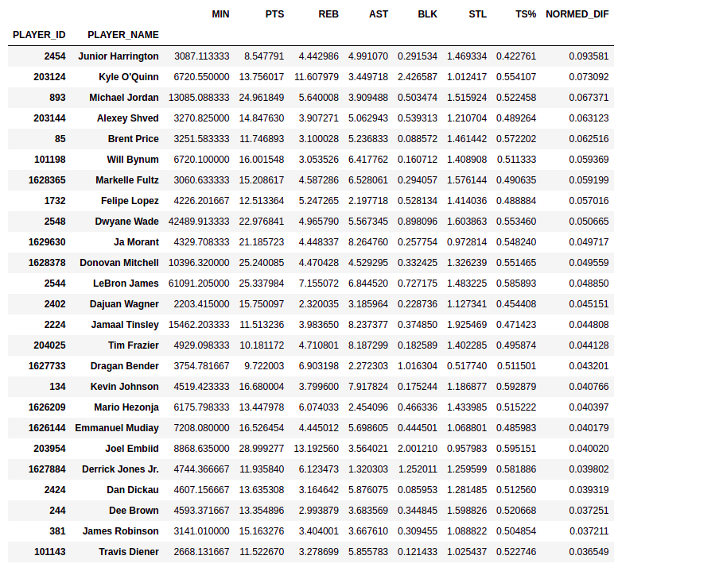

# nba-clutch-analysis
"Clutchness" in the NBA is a term for a player's ability to perform near the end of close games. "Clutch" players are those who can perform well while under those conditions. The issue is - players who are typically described as "Clutch" are players who already perform well anyway, so I sought to determine if there was any basis to those claims. Do players actually play differently in close games?

# INITIAL EDA

First I defined "Clutch" as being the last 5 minutes of a game when both team's scores are within 5 points of eachother. This definition I took from online basketball communities. 

I grabbed player data from stats.nba.stats using an API. Unfortunately, I was only able to get substantial information about players starting in the 1996-1997 season, so thats where my data begins. I was able to get information through the 2020-2021 season including the most recent playoff games. I then averaged each players points, blocks, assists, steals, and rebounds during non-"clutch" and  "clutch" minutes per 36 minutes (which is a standard used throughout the NBA) so that players with a large amount of clutch minutes played do not dominate the data. I also totaled field goal atttempts and free throw attempts in order to calculate a True Shooting % for each player. Then I cut out every player who has played less than 72 minutes of clutch time throughout their entire career. This left me with 1064 player. In this sample an average of 592.6 minutes were played, with a median of 409.64, demonstrating the that there is a large right skew in this data that will be encountered again later.

 
 

# Statistical Test

I normalized the pts, assists, rebounds, blocks, and steals and then added them together to perform a hypothesis test. 

Null Hypothesis: The expected value of these normalized stats in clutch time is equal to othe expected of these normalized stats in non-clutch time (i.e. clutch time has no efffect on a player's performance)
Alternative Hypothesis: The expected value of these normalized stats is different in clutch time than in non-clutch time

Alpha = 0.5

I will use a ttest because I have unequal variance between my two samples (averages in the clutch and averages overall)

# Results

t statistic=-3.344791299084701, p value=  0.0008383792133983506, which is less than 0.05, so I reject the Null Hypothesis

These results are significant. The -t statistic indicates to me that the sample mean on the normalized stats in clutch time is most likely less than the normalized stats in non-clutch time. There are however outliers who are responsible for a significant right_skew of this data who are shown in the following table. These are the 25 players with the highest normed difference.

