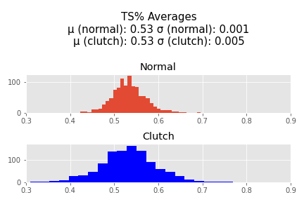

# nba-clutch-analysis
"Clutchness" in the NBA is a term for a player's ability to perform near the end of close games. "Clutch" players are those who can perform well while under those conditions. The issue is - players who are typically described as "Clutch" are players who already perform well anyway, so I sought to determine if there was any basis to those claims. Do players actually play differently in close games?

#INITIAL EDA

 
 

