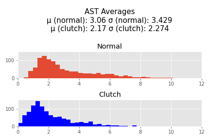

# nba-clutch-analysis
"Clutchness" in the NBA is a term for a player's ability to perform near the end of close games. "Clutch" players are those who can perform well while under those conditions. The issue is - players who are typically described as "Clutch" are players who already perform well anyway, so I sought to determine if there was any basis to those claims. Do players actually play differently in close games?

# INITIAL EDA

First I defined "Clutch" as being the last 5 minutes of a game when both team's scores are within 5 points of eachother. This definition I took from online basketball communities.

I grabbed player data from stats.nba.stats using an API. Unfortunately, I was only able to get substantial information about players starting in the 1996-1997 season, so thats where my data begins. I was able to get information through the 2020-2021 season including the most recent playoff games. I then averaged each players 
points, blocks, assists, steals, and rebounds overall and during "clutch" minutes per 36 minutes (which is a standard used throughout the NBA). I also totaled field goal atttempts and free throw attempts in order to calculate a True Shooting % for each player.

 
 

#Statistical Test

I normalized the pts, assists, rebounds, blocks, and steals and then added them together to perform a hypothesis test. I noticed there was generally a very large right skew in each of these tests 

H0: The expected value of these normalized stats in clutch time is equal to the expected of these normalized stats overall (i.e. clutch time has no efffect on a player's performance)
HA: The expected value of these normalized stats is different

